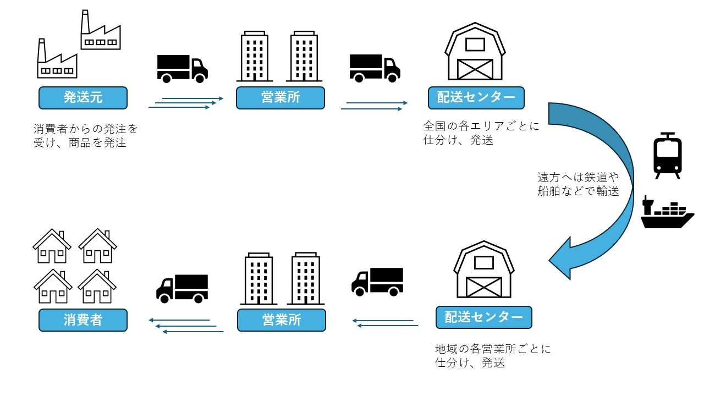
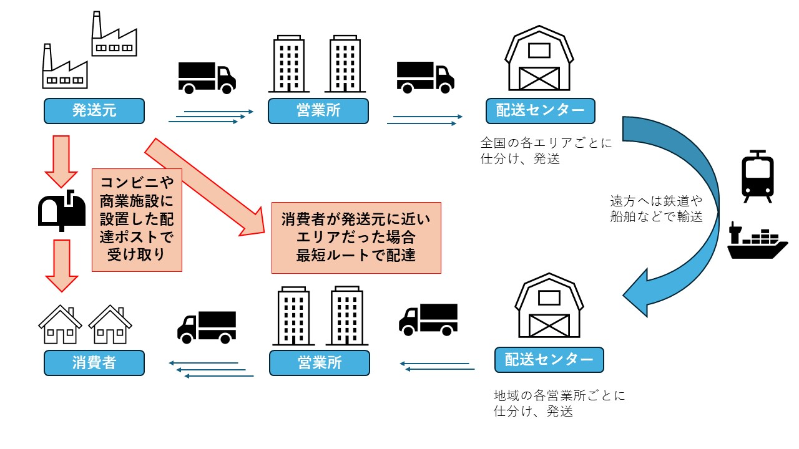
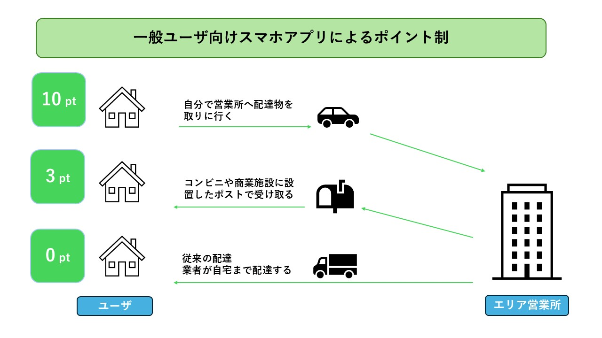
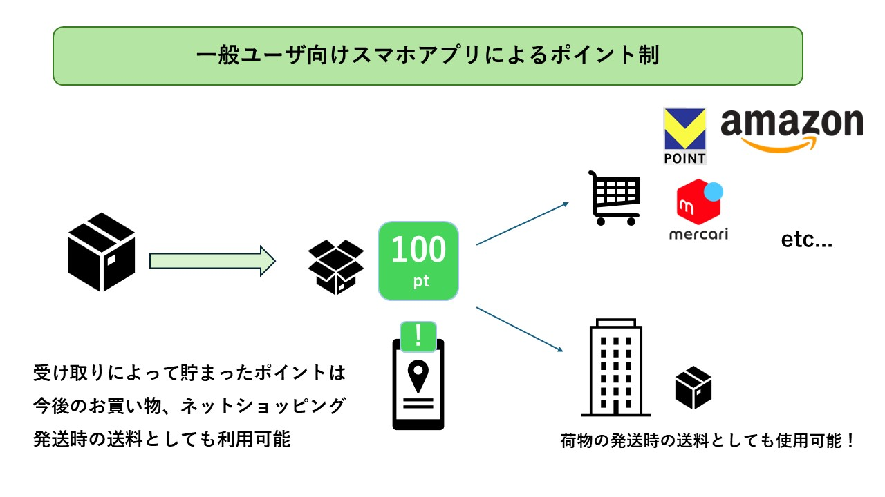

#　AIを用いた高齢者への娯楽
G284382022 影澤利祐

##　ビジネスアイディア（課題・解決策）
- 最近では少子高齢化の問題や円安の問題などが世間を騒がせている。その中で私は、これから割合が増えていくであろう高齢者に焦点を当てようと考えた。課題として今の娯楽では外資系の企業が運営するものが多く、円安によりチケット代が高騰している。なので少子高齢化と円安を課題とし解決策で、日系の企業が運営する高齢者向けの娯楽施設を提案する。その中でAIを活用し今までにないワクワクするような健康ランドのようなものをビジネスアイディアとする。

##　ターゲットユーザ（人口）
- 独身の５０代以上男性、女性。
人口の　男28.25％　女17.81％
参考　（https://www.jili.or.jp/lifeplan/lifeevent/805.html#:~:）

- ６０代以上の定年を退職した方々
　65，665人
参考　（https://www.soumu.go.jp/main_content/000919205.pdf）

- 60代以上の男女
　男　1499万人　女　1962万人
参考　（https://www.stat.go.jp/data/topics/topi971.html#:~:）

##　ビジネスモデル（売上高）
- AI健康コーチ
・専用アプリのようなものをとうして365日24時間管理する
・パーソナライズされた健康目標を選定し、達成度を可視化する。
・健康に関する質問をAIがリアルタイムで解答する。
- AIフィットネスジム
・AIが利用者の動きを分析し、フォームなどを改善する。
・VR技術を導入し、没入感を生み出す。
・グループレッスンでは、AIが参加者のレベルに合わせて運動強度を調整する。
- AIセラピー
・アロマセラピーや音楽療法とAIを組み合わせ、リラックス効果を高める。
・AIが利用者の心拍数や呼吸数に基づいて、最適なセラピーを提供する。

- 収益
- 会員制にし月額制や年額制の会員費を設定する。
- AIによるパーソナライズされたサービスにより別途料金を設定する。
- 健康品や食品のクッズ販売
- 健康診断や医療機関との提携によるよる収益

- 売上高
- 会員数	　　　　　　500人	　　　　　　　
- 月会費	　　　　　　10,000円	　　　　
- 付帯サービス売上	1人あたり月5,000円	
- イベント売上	　　月10万円	　　　　　
- 物販売上	　　　　月5万円	　　　　　　
- 年間売上高	　　　　7,800万円	

##　ライセンス
- ソフトウェア　　　　　ライセンス
- ensorFlow	　　　Apache License 2.0	
　・大規模な数値計算: 深層学習モデルの構築に必要な大規模な行列演算を効率的に実行できるため、複雑なAIモデルの開発に適しています。
　・Googleのサポート: Googleが開発しているため、コミュニティが活発で、豊富なドキュメントやチュートリアルが提供されています。
　・柔軟性: Keras APIなど、様々なレベルのユーザーに対応できる柔軟なインターフェースを提供しています。	
- Apache Kafka	　Apache License 2.0	
　・大規模データストリーム: 実時性のあるデータの収集、蓄積、処理に優れています。
　・スケーラビリティ: クラウド環境での大規模なデータ処理に対応できます。
　・信頼性: データの損失を防ぐための冗長化機能が備わっています。

=======

# 誰でもAIを使いこなそうプロジェクト！
五十嵐健翔　G284092022

#　課題領域　- AI,ソフトウェア
AIによって仕事がとって変わることにより、今ある職がなくなってしまうかも知れません。AIやプログラミングを活用できる「デジタル人材」になることができれば、時代に取り残されたり、対応できなくなることはないのではないかと思いました。デジタル人材になってもらうべく、自己学習ツールや学べる環境の提供を計画します。

# 具体的に何が課題？？
- デジタル人材が2026年には230万人(*1)になると予想される一方,2030年には人工知能等による職業の代替が進み、従業者数が735万人減少(*1)することが予想されています。デジタル人材よりも失業者の方がはるかに大きいことが課題となっており、将来今できている仕事ができなくなる可能性があります。またデジタル人材の中から離職する可能性もあります。離職理由はさまざまだとは思いますが、業界によって10~30%(*2)とIT業界の離職率はまちまちとなっています。しかしながら福利厚生の不十分さや覚えることの大変さ、学びにくさが課題になっていると思いますし、それらを理由に離職してしまう人達が少なからずいます。そういった人たちを減らし、デジタル人材がより増えることを目標にしています。

# 解決策は何がある？
- 大事なのは「自分がデジタル人材になること」だと考えました。そのための解決方法として、「会社側にAIなどを学べる環境を作ってもらう」ことが大事だと思いました。知らない分野に対しての取り組みにくさというのはどうしてもありますし、はじめのうちは上手くいかない経験など誰もがしているかと思います。そのため手取り足取り教えてくれる環境を作ることが大事となります。具体的にはセミナーや研修会を開き、そこに社員さんに参加してもらう形です。
- 他にも会社としてできることとしては「福利厚生の充実」だと思います。やり続けたいと思ってもらうような環境があれば、より説教区的に取り組めると思います。
- また、自己学習ツールを用意することができると思います。会社だけでなく自宅でもできればいつでも取り組めます。英会話や漢字がゲーム感覚で覚えられたりするアプリなどがあります。それを元にゲーム感覚でプログラミングやAIについて学べたらより取り組みやすいんじゃないかと思います。

# 売上試算
i 予想される離職人数 735万人　
そのうちの5%を仮に対象とし、36.75万人とする。
ii 年間パスポートをイメージし、一人当たりの利用料金(年間) 500円
500 * 73.5万*0.05 = 18375万 

# 結論
- 自分の職を失わないためにデジタル人材となるのが大事
- AI,プログラミングについて興味を持って取り組んでもらえば、仕事がなくなる等はなくなるのではないか
- AIなどについて学ぶこと、学ぶ環境を作れれば離職人数を抑えることはできるはず

# 参照下:
*1 NRI未来年表　2025-2100 https://www.nri.com/jp/knowledge/publication/nenpyo_2025/files/000033181.pdf

*2  https://uzuz-college.jp/biz/magazine/28945/
    https://talent-viewer.com/column/rishoku/2689.html
    https://last-data.co.jp/media/it-turnover/

# 配達物完全追跡サービスと連携スマホアプリ

## テーマ「運送業」　　　　G184112021　植野大樹

Amazonやメルカリ、ヤフーフリマなどネットショッピングが当たり前となった現代。特に年末年始はその需要が高まり、運送業界は大忙しとなる。  
しかし以前から問題となっていたドライバーの不足や再配達などによって一人一人の配達員への負担が増える一方である。そこで私は新たな情報サービスとスマートフォンアプリケーションを利用したビジネスモデルでこの問題を解決していこうと思う。

---
### 荷物の流れ

まず現在の運送業における課題を確認するため、 **ネットショッピング** とメルカリなどを含めた **個人から個人への配送** の流れを確認してみよう。

**図1** のように注文を受けた商品は**各地域の営業所**に集められ、そこからより大きな**エリアの配送センター**に集積される（実際は発センターと着センターがある）。
配送センターでは集められた荷物を全国のどの配送センターに輸送するか仕分けられ、発送される。

そして配送センター（着センター）に届いた荷物は、エリア内のどの営業所に配送するか仕分けされ発送される。
営業所に仕分けられた荷物は配達員によって自宅やオフィスへ配達される。

---
### 業界の課題

令和5年に国土交通省から発表されたデータでは、国内における貨物の輸送はその9割を自動車による輸送が占めていることがわかる。  
[貨物輸送の現況について（参考データ）国土交通省](https://www.mlit.go.jp/seisakutokatsu/content/001622302.pdf)  

このデータからトラックなどの自動車による輸送が大きな役割を担っていることが分かるが、平成27年に行われたトラック輸送状況の実態調査によると、ドライバーの4割が40代であり、50代が3割、30代が2割以下。  
20代は1割にも満たないことが分かっている。
[トラック輸送状況の実態調査（国土交通省）](https://www.mlit.go.jp/common/001128767.pdf)

これらのドライバー不足＆高齢化に加えて近年の配達物の増加も大きな課題となっている。かつては営業所から会社や店舗への配達が主だったが、 **ネットショッピングの普及** によって各家庭への配達が増え末端の配達員への負担が増加している。

そして配達物の量の増加に伴い、各営業所や配達センターには今までとは比べものにならないほど **大量の荷物が運び込まれ、それらを行き先ごとのトラックに積み込む必要** がある。  
しかし実際には荷物の仕分け、積み込み、届いた荷物の荷下ろしなどの作業が間に合わず、 **トラックドライバーの待ち時間** が発生しているケースが多くある。

**まとめ**
- `ドライバーの高齢化、不足`
- `需要増加に伴う配達量の急増`
- `トラックへの積み込み、荷降ろしによる待ち時間の発生`

---
### 解決策

前項で説明した課題に対して、私が提示する解決策は **配達物完全追跡サービスと連携したスマホアプリの開発** だ。  
要はすべての荷物をデータベースで管理し、配達を効率化するということだ。

**図1** のようにすべての荷物は  
**発送元→営業所→配送センター→配送センター→営業所**  
の順で消費者に届けられる。しかし消費者が発送元に近い場合、 **遠回りになり輸送の手間が増えてしまう** ことになる。
配達の効率化は以前から問題になっていたが、現場の従業員による新方式への不安や、
社会を支える仕事のため業務を止めることが出来ない問題があった。

そこで荷物に **専用のバーコード** を貼り、読み取ることで荷物の情報（発送地、送り地、サイズ、種類）をデータベースに登録。
事前に登録しておいた営業所や配送センターの場所、お互いの距離、輸送時間などから最短ルートを提案。  
配送センターまで輸送する必要が無い荷物は **その地域内で配達を済ませてしまう** ことが可能になる。

また **図2** のようにコンビニや商業施設に設置した配達ポストでの受け取りによって、自宅まで配達する手間を少しでも減らすことが出来る。  
実際、このような荷物を受け取るポストは[日本郵便の「はこぽす」](https://www.post.japanpost.jp/service/hakopost/)など設置が進んでいる。
荷物をデータで管理することによって、これらのポストへの配送も効率的にこなすことが出来るようになる。

しかし荷物の行き先が増えることによって、営業所や配送センターでの仕分けや積み込みは複雑化。
より多くの待ち時間が発生することにつながってしまう。  
この問題には、実は解決策がすでに存在している。 **ピッキングロボットの導入** だ。
実際、大がかりな設置を必要とせず、部分的な場所と期間で導入するピッキングロボットのさサブスクリプションのサービスも存在している。（[plus-automation](https://plus-automation.com/robot-service/)）

今後このような自動化が進むに当たって、荷物をデータで詳細に管理することはより重要になってくる。
またトラックの出入記録を管理することで、積み込みや荷下ろしによる遅延状況を他のドライバーに通知。
待ち時間を減らし、必要に応じて **他の営業所や荷物の回収に人員を回す** ことが出来る。

これらに加え、一人一人のユーザに向けた取り組みも行う必要がある。
それはスマートフォンアプリのポイント制によって、 **ユーザがなるべく自分で荷物を取りに行く** よう誘導するということだ。

**図3** のようにユーザが自ら荷物を受け取ることで”お得”になるよう設定。
一軒一軒自宅を回るのではなく、小エリアのポストにまとめて配達することで配達の時間と手間を削減することが出来る。

また貯まったポイントは **荷物の発送** や **お買い物** に利用出来るようにすれば、
さらにユーザの行動を促すことが出来る。

**まとめ**
- `ドライバーによる輸送を最小限に減らす`
- `情報システムを使った積み荷の管理によって配達の効率化を図る`
- `仕分けとピッキングの自動化とそれを管理する情報システム`
- `ユーザに荷物を取りに行くよう促すシステム`

---
### 具体的なビジネスモデル

前項で提示した解決策を踏まえてより詳細なビジネスモデルを考えていきたい。

このサービスにおいて必要なのは
- すべての荷物を管理するデータベースとマネジメントシステム
- 荷物を配達するドライバーや配達員向けのアプリケーション
- 受け取り、発送する一般ユーザー向けのアプリケーション

#### `主要な運送業者`
- ヤマトホールディングス
- SGホールディングス
- アルプス物流
- 福山通運

#### `ドライバー`
6万3千人[^1]

#### `一般ユーザー`
郵便や配達自体はほぼすべての国民が利用するが、その中で関したアプリケーションを
ダウンロードする割合は限られている。今回はメルカリの年代別の利用者割合から、一般ユーザーの割合を試算する。

2023年メルカリが発表した情報[^2]よりアプリをダウンロードする可能性がある人口を世代別に試算してゆく。
2022年のメルカリ利用者数は2200万人。同記事の年代別利用者の割合から、各年代の利用者数を算出する。  
その値を
[e-Stat（政府統計の総合窓口）](https://www.e-stat.go.jp/stat-search?page=1&toukei=00200524&bunya_l=02&year=20220&month=24101212&metadata=1&data=1)
の2022年の世代別人口統計と照らし合わせ、世代別のメルカリ使用割合を推定する。

この割合を2030年の人口予想に照らし合わせて、将来のユーザー数を算出。

| 年代 | 利用者数 | 社会におけるメルカリ利用率 | 2030年の利用者数 |
| :---: | :--- | :---: | :---: |
| 10～20代 | 792万人| `43.6%`| 749万人|
| 30代 | 484万人| `35.6%`| 462万人|
| 40代 | 418万人| `24.1%`| 341万人|
| 50代 | 506万人| `28.8%`| 519万人|
| | | 合計 | `2071万人`|

[^1]：[日本のトラック輸送産業現状と課題 2024](https://jta.or.jp/wp-content/themes/jta_theme/pdf/yusosangyo2024.pdf)  
[^2]：[2023メルカリ基本情報](https://about.mercari.com/press/news/articles/20230630_infographics/)

#### `年間売り上げ`

[LNEWS物流ニュース](https://www.lnews.jp/2023/05/p0510310.html)
によるとヤマトホールディングスは営業所を2027年3月期には約2000に削減する予定である。よって試しに以下のように価格を設定すると

例）一つの営業所のシステム利用料（必要な設備費用を含む）：5万円/月

2000箇所（営業所数）× 5万円（月の利用料）× 12ヶ月 = 12億円

これを単純に上記の主な運送業者に当てはめると年間売り上げは **`48億円`** になる。

#### `使用するOSS`

現場の配達員や仕分け作業員が使用するアプリケーション → `Android OS`  
一般ユーザ向けのスマートフォンアプリケーション → `Android OS`

**選考理由**：Android OS はスマートフォンやタブレットでの利用に相性が良いため

荷物の情報や現場の情報等を集計し管理するデータ管理システム → `firebird`  

**選考理由**：大容量の処理が可能/企業利用の事例もある

#### `ライセンス`

**Firebird** ：[IPL(InterBase Public License) ](https://www.firebirdsql.org/en/interbase-public-license/) 
  
（商業利用の際の広告には以下の文章を記載
"This product includes software developed by Inprise Corporation. "）

**Android OS** ：[Apache 2.0](https://www.apache.org/licenses/LICENSE-2.0)

[^1]: (https://jta.or.jp/wp-content/themes/jta_theme/pdf/yusosangyo2024.pdf)  
[^2]: (https://about.mercari.com/press/news/articles/20230630_infographics/)
