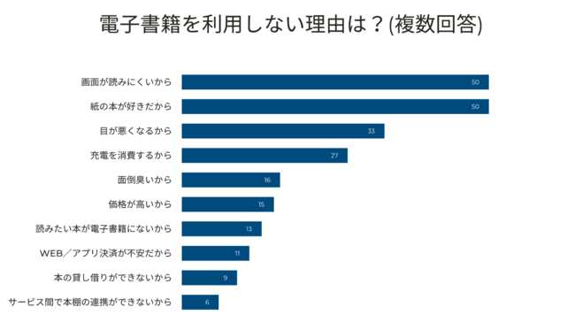
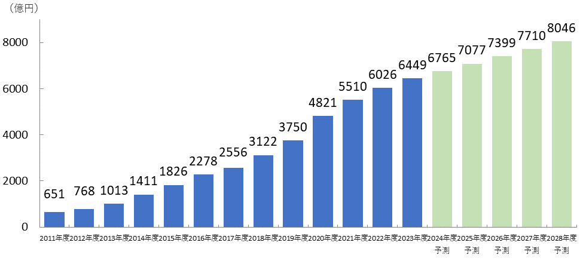

# ARで投影する電子書籍
## G284112022 石川　祐万

## 概要

電子書籍は便利ではあるが、未だ紙の本のほうが売れ行きは良く紙の本を好む方が多い。　 

　その理由は電子書籍を読む際に読みづらさを感じる人や紙の質感が好きということが多いようだ。 
　そのため、通常の書籍に読書感を近づけることでこのデメリットを低減することができると考えこの「ARで投影する電子書籍」というアイディアを提示した。 
これにより今まで電子書籍を利用しない層に利用して貰えるのではないと考えた。

## はじめに
　人間は紙を開発して以来、長い間ほぼすべての情報媒体として紙を利用していた。 読書という行為には
本が必須であり、ラジオやテレビなどが普及してもそれは変わらなかった。 明確に読書という行為に本以外の選択肢ができたのはテレビの発展形であるパソコンディスプレイが生まれてからだ。 
液晶等のディスプレイ装置は本と同等の役割を担うと期待されていた。 
しかし、実際には紙の消費量は増えつづけ電子書籍が紙の本を脅かすことはなかった。 
その理由は読みづらいという点や紙の本が好きである人が多いなどである。 
　そのため私は、ARを利用して紙の本で電子書籍を読めるシステムのアイディアを考えた。 
このシステムはARマーカーが背表紙を含めて1ページずつ印刷された本にARデバイスを利用して本の内容を投影するというイメージである。 
また、あくまでARマーカーであるためQRコードと違い表示する内容を自由に設定できると考えた。

  
図1.電子書籍を利用しない理由

## 本論
### ビジネスアイディアの課題
 　電子書籍の課題は3つほどあると考える。まず、第1に読みづらい事、第2に紙の質感やめくる感覚がない事、第3に所有欲を満たしづらい事である。 
第1の課題について、電子書籍が読みづらい要因として本の大きさが影響しているため、実際の本に投影する形であればこの問題は解決する。 
また、文字の大きさを変えることもできる為実際の本より優れている点もある。   
第2の紙の質感やめくる感覚についても、実際の本に投影しているため感じることができる。 
第3に所有欲に関しては、本棚に複数個のバーコード本を並べてARを通してみることで実際の本棚と同じように見ることができるため電子書籍よりは満たされるのではと考える。   
　この方法の利点としては、所有欲を満たしながら本を保管するスペースが少量で済むという点である。このメリットは大きく本を200冊や300冊、 
それ以上の本を所有する場合本棚のスペースの確保が難しくなる。   
　これ以外のメリットとしてARグラスを利用しているため、別タブで検索をすることやその検索結果を本のページに紐づけることができると考える。 
また、グラフや図を拡大して見ることも可能だと考える。  その他に、本そのものは貴重ではないため替えを用意することが容易であるため、 
一部の稀覯本のように暗室で保管するなどの丁寧な保存の必要がないという点もメリットといえる。   
### ターゲット層
　このビジネスアイディアのターゲットは電子書籍を現在利用している人と上記の課題を理由として電子書籍の利用をしていない人である。 
この条件に当てはまる顧客はおよそ103万人だと考える。根拠として総務省統計局の令和３年社会生活基本調査によると日本の漫画を除く書籍の利用者は31.6％(1)であり、 
書籍の利用者は日本でおよそ393万人(2) である。 
そして電子書籍ビジネス調査報告書2024によると47.5%のモバイルユーザが電子書籍を利用している(3)と記されている。 
その上で上記の課題を理由として株式会社LANYと株式会社ロビンソン・クルーソーの共同アンケートに電子書籍を利用していないのはおよそ5割(4)と記されているからである。 
　しかしながらこの条件以外にも2030年ではAR技術が今よりも手軽であり、誰でも扱えるものでなければこのアイディアを生かすことは難しい。そもそも、ARグラスは 
スマホと違い日常生活に必須とは言えないためあまり持つ人間も多くは無いと考えられる。  
また、今も紙の本を利用している顧客のうち60歳を超える方も多く、そういった方がわざわざAR技術に手を出し読書の方法として取り入れるかどうかという問題もある。  
それだけではなく、現在ARデバイスがおよそ3万円から50万円ほどの幅があり、今より普及したとしても安くて2万円ほどと考えるとなかなかに高価であると言える。  
　以上の点から、実際の利用者はそう多くは無いのではないかと考えられる。私は、利用者はおよそ103万人の半分未満だと考える。その上でこのビジネスアイディアで 
金銭が発生する点はARグラス、ARマーカのついた本、電子書籍の3点を購入するときである。 
　まず、ARグラスに関してはコストパフォーマンスの善い5万円のモデルを基準と考え、ARマーカ付きの本は文庫本と通常の本の2種類あるとして合計で2千円程度とする。  
この時点で条件に当てはまる利用者の半分が全員買う想定ではあるがおよそ267億円の売り上げが見込める。 
しかし、これに関しては一度買えば壊れない限り買い替えの必要がないため継続的な利益とは言えない。  
　それに対して継続的な収益を見込めるのは電子書籍である。2023年度のデータとして電子書籍市場規模は6449億円であり物価だがの影響で伸び率は落ちているがそれでも前年比7％増加している。 
また、将来的に8000億円の市場に成長すると予測されているため(3)(図2)ある程度の利益は見込めると考える。具体的には現在は平均で毎月3056円を本に使ってるため(5) 
市場の成長を見るとおよそ1.3倍ほどになると予想し、これを年間に直すとおよそ4万8千円ほどになり上記と同等の利用者が購入するとすればおよそ25億円の利益を獲得することができると考える。  
　よってこのアイデアによる年間売り上げは最初は高く6000億に近づくがARグラスが行き渡るにつれ、最終的に25億円ほどの利益に落ち着くと考える。

  
 図2.電子書籍市場規模

### 利用できるOSS

このアイディアを実現するために利用することができるOSSとして「ARToolKit」、「Unity」が利用できると考えた。 
　「ARToolKit」は様々なOSに対応しており、ARマーカーを用いてコンテンツを出すこと等ができる。これにより本に投影することが可能だと考える。(6) 
また、ライセンスについてはLGPLv3であり改変部分の公開義務はあるが無料で利用可能である。  
　「Unity」は、多くのOSに対応しており、上記の「ARToolkit」を利用することができるゲームエンジンであり、今回のアイディアに利用できると考えた。 
ライセンスはMIT/X11であり著作権表示をソフトウェアの重要な部分に記載すれば無制限に扱える。 
しかし、サブスクリプション型のサービスであるため、売り上げが20ドルを超えると有料のプランを利用する必要がある。(7)

## 結論
　今回は本にARで投影して電子書籍を読む手法について検討した。その結果、そもそも2030年にAR技術が一般的かという不透明性や新しい技術に対する拒否感等が課題になると予想された。 
しかし、多く電子書籍が読みやすくなる点や検索と同時進行で読書ができる点、検索結果やメモ、画像等をページに紐づけることができるなど、多くのメリットもあると考える。 
　そして、最大限売り上げた場合だとしても最終的な年間売り上げはおよそ25億円と予想される。 
そのため私は、このビジネスプランはソフトやARグラス等のハードウェアを開発するコストに対してリターンがそれほど大きくはないのではないかと思う。 
　しかしながら、よりARが一般化して誰もが利用することが普通になっていれば新しい読書体験を得られるサービスの一環として提供することで 
電子書籍の業界に良い影響を与えることができるのではないかと考察する。 
## 参考文献

> (1) 総務省統計局.令和３年社会生活基本調査　生活時間及び生活行動に関する結果　結果の要約　p.7「趣味としての読書(漫画を除く)」：　https://www.stat.go.jp/data/shakai/2021/pdf/youyakua.pdf

> (2) 総務省."（2023年（令和5年）10月1日現在）‐全国：年齢（各歳）、男女別人口 ・ 都道府県：年齢（5歳階級）、男女別人口‐". 総務省統計局. 2024-04, https://www.stat.go.jp/data/jinsui/2023np/index.html, (参照 2024-12-01) .

> (3) 落合　早苗 著,真柴　涼 著,まつもとあつし 著,菊池　健 著,飯田　一史 著,インプレス総合研究所. 電子書籍ビジネス調査報告書2024. 株式会社インプレス, 2024/07/25, p.16 p.246-247

> (4) "【男女169人調査】電子書籍を利用しない理由を約3割が「画面が読みにくいから」と回答。改善されれば利用を検討も［LANY］". 日経COMPASS. 2021-10-19, https://www.nikkei.com/compass/content/PRTKDB000000020_000071062/article, (参照 2024-12-27) .  

> (5) 統計局. 家計調査報告 〔 家計収支編 〕 2023年（令和５年）平均結果の概要. 2024, 2,　p.5. https://www.stat.go.jp/data/kakei/sokuhou/tsuki/pdf/fies_gaikyo2023.pdf, (参照 2024-12-27) .

> (6) M・SOFT."ARToolkit". M・SOFT.  ,https://www.msoft.co.jp/service/artoolkit.html, (2024-12-28).

> (7)Unity Tecnologies. "Unity" Unity. 2024. プランと価格-Q&A ,https://unity.com/ja, (2024-12-28).