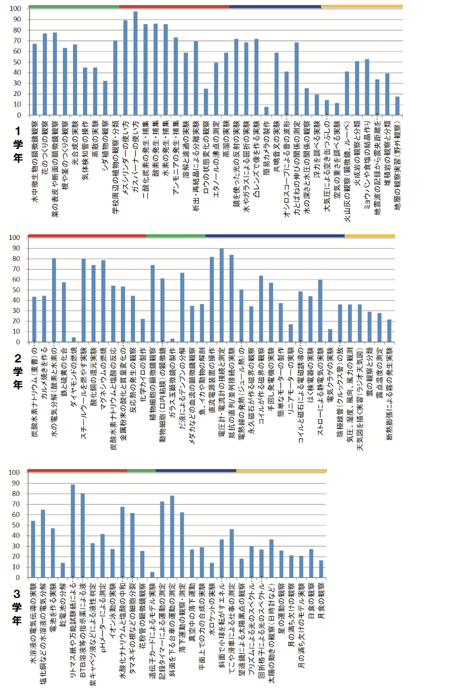

# 教育系に関するビジネスアイデアについて
#### 工学部情報工学科　3年
#### G284832022 内藤泰良
----
## 1.理系学習・授業AIサポートサービス
### 概要：<b style="border-bottom:solid 2px red;">理系科目（小学理科　中学理科　高校理科）が中心になっている学習サポート</b>
現在（2024年）、実験の頻度に学校ごとのばらつきがあり、全体的には低下の傾向がある。小学校、中学校、高等学校と**実験を通した学習は**非常に充実した学習であり、**教科書上の知識との差を埋める役割がある**。 
 
**図　学年別・項目順の総合集計結果**（「学生アンケートに見る 中学校・高等学校における理科実験の体験率」p70より）
 サービスを通して、教師側の準備時間を減らしたにした上で、実験を体験すことができる。また、休んでしまった人やもう一度見たい人に向けのアーカイブを配信んすることでより学習をうかめる事ができる。資料を配布することで、活用している先生のレベルをある程度担保する事ができる。
 

### 主要サービス内容

>- AIを用いた質問解答と実験動画の投稿（実験全体の映像と変化の様子を表した部分映像）
>- 実験資料の配布
### 解決できる課題

>- 理科科目の実験数が少ない学校において、実際に実験をする映像を見ることで学習内容の理解度をあげる

>- 授業・実験に使うAIを用いて作成する（実験は教師用及び生徒用の手順書）

参照
 - [学生アンケートに見る 中学校・高等学校における理科実験の体験率](https://www.google.com/url?sa=t&source=web&rct=j&opi=89978449&url=https://kitasato.repo.nii.ac.jp/record/544/files/067-076_kenkyunote2_kkck5%25282019%2529.pdf&ved=2ahUKEwjMmLjKv9eKAxUscPUHHdlPKSAQFnoECBUQAQ&usg=AOvVaw3GWE6fZB8oTkvACwlQX-XJ)  ＊画像は同ファイルにもございます

 ---
 ## 2. ターゲットユーザの人口
 | 2024年度　|生徒|教師|
 |:-:|-:|-:|
 |小学校|5,941,733|425,174|
 |中学校|3,141,132|247,426|
 |義務教育学校|79,811|8,216|
 |高等学校|2,906,921|223,201|
 |中等教育学校|34,514|2,901|
 |特別支援学校|155,140|89,013|
 |専修学校|609,875|39,078|
 |その他|14,041|10,986|
 |**合計**|**12,883,167**|**1,045,995**|
 ##
> 2024年全国人口：**123,790,000**(人)  
>（生徒・教師）合計：**13,929,162**(人) （11.3%） 　
> 2030年予想人口：**120,116,000**(人)  
> 2030年の利用者は2024年の学生・教師人口割合と2030年の予想人口から出す 
> 2030年の教師と生徒の総人口：
> 120,116,000　×　0.113 =　**13,573,108**(人) 
>

参照
 - [文部科学省　令和6年学校基本調査](https://www.mext.go.jp/content/20241213-mxt_chousa01-000037551_01.pdf) 
 - [人口推計2024](https://www.stat.go.jp/data/jinsui/pdf/202410.pdf) 
---
## 3.売り上げ見込み
#### ビジネスモデル　：サブスク制
 > 理由：ユーザがサービスを長期間（年単位）利用することを考えているためサブスク制が活かせると思いました。また、今後に**追加するオプション**や**新しいプラン**のグレードアップが行いやすい点も挙げられます。時間外サポートや優先カスタマーサービスなども追加オプションとして提供されることが多く、ユーザーのニーズに応じて柔軟に選べるため、各ユーザーが自身に**最適なパッケージ**を組み立てることができます。

  >  月料金：1500（円）
  >  年間売り上げ：1500 × 13,573,108 = 20,359,662,000 **（203億6000万円）**
    
---
## 4.技術構成要素
#### 0SSとライセンス
|OSS|ライセンス|利点|
|-|-|-|
|[Apache Tomcat](https://tomcat.apache.org/)|Apache License version2|Javaが動作する多くのプラットフォームで利用可能なWebコンテナである。 セキュリティアップデートが頻繁に行われている。 最小限の設定で起動可能ない リソースの消費が比較的に少ない。|
|[TensorFlow](https://www.tensorflow.org/?hl=ja)|Apache License version2|演算処理や機械学習による計算や実験結果をまとめる事が容易になる。|
|[MLflow](https://mlflow.org/)|Apache License version2|実験の記録と検索が容易にするためのOSSである。|
|[Cassandra](https://cassandra.apache.org/_/index.html)|Apache License version2|データの分散配置が可能であったりスキーマ定義がある大容量のデータベース 実験や情報をより細分に見れるように多くの容量があるCassndraが最適だと思いました。|

#### 選定した技術
|技術|理由|
|-|-|
|生成AI|関連する分野の実験をもとに問題の自動生成をできるようにする。|
|AI|機械学習のOSSと併用しチャット内で質問の返答を可能にする。|

参照
- [OSS一覧](https://openstandia.jp/oss_info/)

---
## 今後の展望

 追加されるオプション案として実験イベント情報を記載する掲示板や生放送実験イベントなどがこの一つのサービスでできると良いなと考えている。 実際に教科書に書いてあるものをイメージできない人も多いため今後こういうサービスが追加されていきたい。

---

 全体参照一覧 

0SSとライセンス

 - [文部科学省　令和6年学校基本調査](https://www.mext.go.jp/content/20241213-mxt_chousa01-000037551_01.pdf) 
 - [人口推計2024](https://www.stat.go.jp/data/jinsui/pdf/202410.pdf) 
 - [OSS一覧](https://openstandia.jp/oss_info/)
 - [Apache Tomcat公式](https://tomcat.apache.org/)
 - [TensorFlow公式](https://www.tensorflow.org/?hl=ja)
 - [MLflow公式](https://mlflow.org/)
 - [Cassandra公式](https://cassandra.apache.org/_/index.html)
 - [学生アンケートに見る
中学校・高等学校における理科実験の体験率](https://www.google.com/url?sa=t&source=web&rct=j&opi=89978449&url=https://kitasato.repo.nii.ac.jp/record/544/files/067-076_kenkyunote2_kkck5%25282019%2529.pdf&ved=2ahUKEwjMmLjKv9eKAxUscPUHHdlPKSAQFnoECBUQAQ&usg=AOvVaw3GWE6fZB8oTkvACwlQX-XJ) (山本 明利 北里大学理学部 最終閲覧日:2025年1月3日)
 

