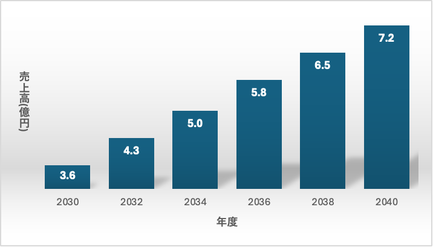

# 教育link

##### 学籍番号　G284992022 　氏名 平野高良
***

## 1.サービス概要
教育業では、教員不足により教員一人当たりの負担増大や都市部と地方での教育格差が問題となっている。
このサービスは主に教員不足となっている小中学校に勤務している教員に向けて、別地域の教員との授業資料共有などの連携やAIを活用した授業の補助を提供する。
サービスを利用する教員の負担軽減やAIの学習による指導方法の適正化を行い、教育格差の軽減を目標とする。

***

## 2.ターゲットユーザと人口試算
#### ターゲットユーザ：全国の小中学校及び教員
文部科学省が調査している統計情報（資料１、資料２ 共に学校数、教員数参照）を参考にすると、令和3年度時点での学校数と教員数は小学校  **19,336校**、**422,864人**、中学校**10,076校**、**248,253**人であった。
また、同省が令和4年度に発表した「『教員不足』に関する実態調査」（資料3 4ページ目参照）を参考にすると、令和3年度の年度の始業日時点で小中学校全体の**5.６**%の学校で教員不足が生じていた。

##### 利用者の試算
資料2では予定数よりも多く教員を配置している学校があったため、全国の学校にはほとんど均等に教員が配置され、教員不足の割合は変化しないと仮定する。
利用者は、教員不足の学校（約1,600校）に勤務する教員と、教員数が足りている一部学校に勤務している教員を合わせた、**3,000校**、**70,000人**（学校数・教員数共に全体の約10％）とする。
また、2040年度には全体の20%程の普及率を目標とする。
***

## 3.ビジネスモデル及び年間売上高の試算

ビジネスモデルは、学校単位での月額契約とする。
学校ごとの契約であるため、教員ごとに使用料の支払いは発生しない。
#####　売上計算

サービスの月額料金（１校あたり）：10,000円
サービスの年間料金（１校あたり）：10,000円×12ヶ月=120,000円
年間総売上高：120,000円×3,000校=**3.6億円**

2040年度までに以下のグラフのように売り上げを伸ばすことを目標にする。
120,000円×6,000校=7.2億円

***
## 4.主な機能及び技術的構成要素

##### 資料共有機能
教員同士がサービス内で公開した資料を使うことができる機能。

##### スケジュール管理機能
部活動や課外活動などのスケージュールを一括管理する機能

##### AIサポート機能
チャットボットによる簡易的な質問回答などAIが業務の一部をサポートする機能

#### 構成要素
| 構成要素 | OSS名 | ライセンス | 選定理由 |
| - | - | - | - |
| webアプリケーション | Django | BSD | 機械学習が利用可能なPythonで書かれていて、汎用性も高いため |
| クラウド | Nextcloud | AGPLv3 | オンプレミスにサーバーを構築でき、チャットによる意思共有も可能。ossを基盤としたカレンダーアプリもある |
| AIチャット | iroha Chat | GPL | 解法を教えるなど教育に適した対話が可能 |
| データベース | MySQL | GNU GPL | iroha Chatの利用に必要 |
| フロントエンド | React | MIT | シンプルな構成にすることが可能であり、 |

***
##### 参考資料
資料1:https://www.mext.go.jp/content/20220530-mxt_chousa01-000021527_04.xls （最終閲覧日2024/12/29）

資料2:https://www.mext.go.jp/content/20220530-mxt_chousa01-000021527_05.xls (最終閲覧日2024/12/29)

資料3:https://www.mext.go.jp/content/20220128-mxt_kyoikujinzai01-000020293-1.pdf (最終閲覧日2024/12/29）)
