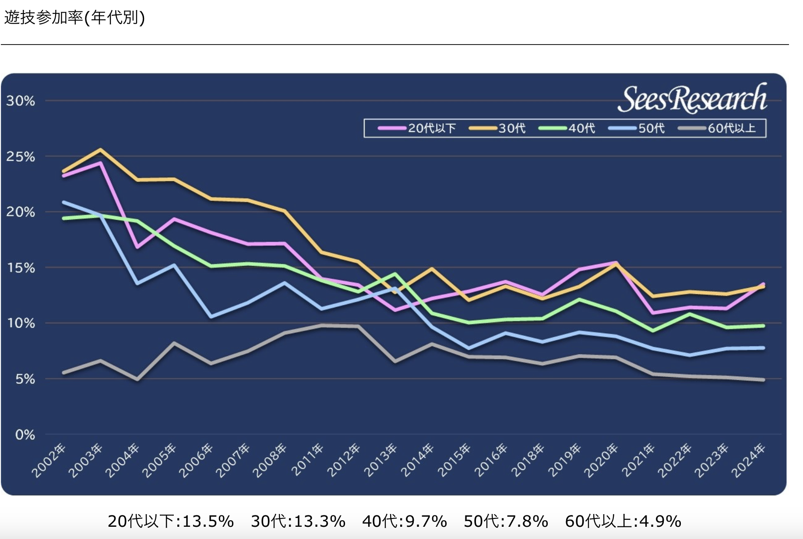
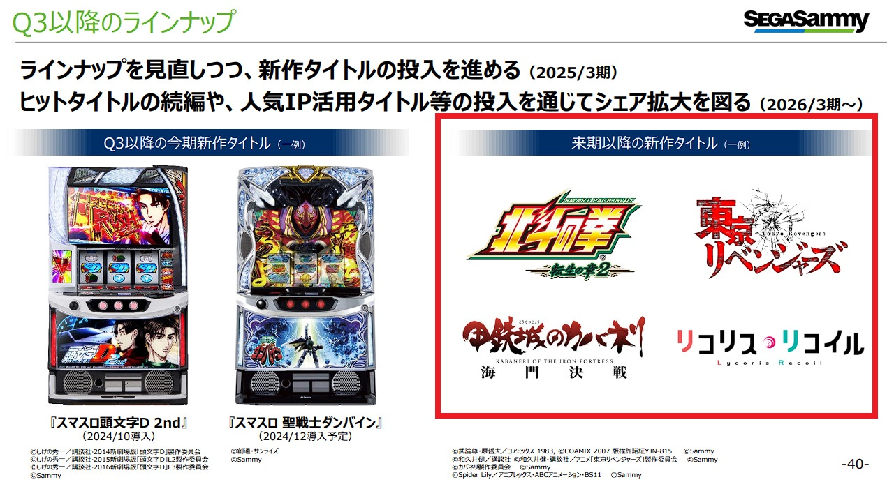

#　VRでパチンコ、パチスロ体験

#### G285052022 本間涼也
## パチンコ業界の立ち位置
娯楽産業の中でも市場規模が約15兆円と大きい存在である。
## パチンコ業界の課題
 年々遊技人口が減っている。若者の遊技者が少なくこれからの遊技機業界の存続を考えると若者に一度はパチンコ、パチスロを触れて欲しい。
### 解決策
 VR空間を使った新しい遊技体験を実施するビジネスアイデアを考えることにした。最初は若者向けにアニメ作品のパチンコ、パチスロ台の稼動を考えている。
***
### 3. ターゲットユーザ
下の画像グラフはレジャー白書2023年よりパチンコ、パチスロの遊技人口の分布を示しています。

ターゲットは２０代から３０代を対象に遊技人口を増やしていきたい。目標は20代、30代どちらも20%を超える目標にする。

メタバースの国内利用者数が600万人と推定されている。20代と30代の利用者が40%であるため240万人と仮定する。そこからパチンコ、パチスロに興味を持つ人は20%と仮定して120万人とする。
## 4. ビジネスモデル年間売り上げ
- 月間利用率を2回と仮定する(24回/年)
- 月額1000円のサブスクリプションモデルで考える。
 試算結果
- 120万×2×1000 = 240億 
## 5. 構成要素
- VR開発環境：Unreal Engine + Pixel Streaming
- セキュリティ：OpenVPN
- 決済システム：WooCommerce

#### 選定理由
- Unreal Engine 高品質なグラフィックから遊技機のど派手な演出の再現に最適だと思ったからです。
- Pixel Streaming VR空間の軽量、配信も可能な点から選びました。
- OpenVPN サーバーとクライアント間で安全性と速度といった通信環境を構築できるから選びました。
- WooCommerce paypal、Stripeなどの決済システムと連携が可能であり、日本円での決済やコンビニ決済などに対応できるから選びました。
***
## おまけ　
Sammyが決算報告でリコリスリコイルのパチスロを2025年に向けて開発しているので期待したいと思います。

###　参考文献
- レジャー白書2023(パチンコ、パチスロ遊技人口)
https://sees-research.com/trends2024_0725/?utm_source=chatgpt.com

- メタバース総研
https://metaversesouken.com/metaverse/users/?utm_source=chatgpt.com

- Sammy 決算プレゼンテーション資料
https://www.segasammy.co.jp/cms/wp-content/uploads/pdf/ja/ir/20241108_q2_presentation_j.pdf